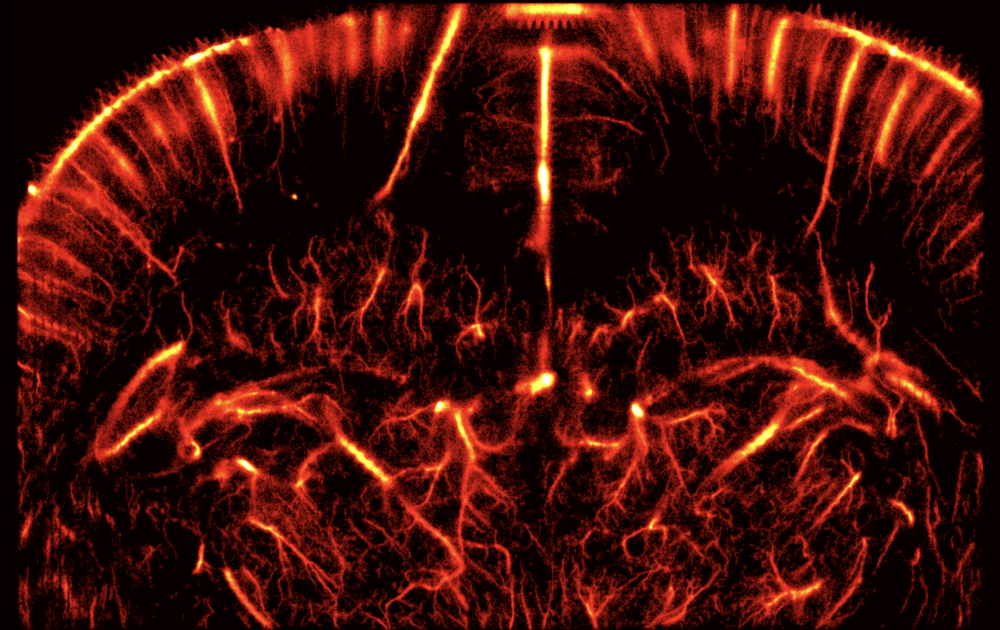

# ULM-PINN

A physics informed neural network (PINN) pipeline for microbubble tracking in Ultrasound Localization Microscopy (ULM). It is written entirely in Python and covers the whole pipeline after localization: given a set of microbubble localizations, it seeds a velocity prior, learns a Stokes regularized velocity field, re-tracks the detections with that field, and renders super-resolution maps.

This folder is self contained and you run it on your own localization data.



*In vivo rat brain: ULM-PINN super-resolution intensity map.*

## Abstract

Ultrasound Localization Microscopy (ULM) overcomes the diffraction limit of conventional ultrasound by localizing and tracking microbubble contrast agents to visualize microvascular structures and flows with ≈10 μm resolution. While many trackers rely on geometric association alone, they do not explicitly enforce fluid dynamic consistency. In this work, we present ULM-PINN, a physics regularized tracking framework that embeds simplified Navier-Stokes constraints into microbubble data association to produce physically plausible trajectories. The PINN is trained with a curriculum strategy that first fits microbubble derived velocity data using a Huber loss for robustness to outliers, then gradually introduces Stokes flow residual penalties; the resulting velocity field is used to guide frame-to-frame assignment via the LAPJV solver. We benchmark ULM-PINN against three baselines (Hungarian, Kalman filter, and data-only NN) on the ULTRA-SR in silico challenge datasets (Simple tuning and Complex holdout), assuming perfect localization and evaluating Jaccard index, velocity error, and divergence. Key hyperparameters including network architecture, physics weight, collocation density, and training schedule were systematically optimized through ablation studies. Our results show that at sub-100% data densities, physics regularized tracking consistently outperforms the architecturally identical data-only NN and outperforms Kalman filtering more substantially; the physics and data-only NNs are statistically indistinguishable at full density and Kalman's temporal prediction leads at the sparsest (25%) regime, confirming that the physics prior is most valuable when observations are sparse but not extreme. Across all regimes, the physics regularized fields have much lower in plane divergence than data-only NNs. On in vivo rat brain data, where ground truth trajectories are unavailable, PINN tracking matches the geometric (Hungarian) baseline at the native frame rate and, under lower frequencies, recovers ≈2× the inter frame displacement of nearest neighbour and constant velocity association. Across two acquisitions of the same brain, the reconstructed velocity fields are quantitatively consistent with established rat cortical hemodynamics, including physiological flow speed distributions, a positive velocity-vessel-caliber scaling (larger vessels faster), and high split-half reproducibility. Reference free map quality metrics further indicate that the PINN guided super-resolution maps are finer in Fourier ring correlation resolution and more reproducible than the geometric baseline in most acquisitions, with the gap widening under frame skipping. We provide our code and pipeline at github.com/EG-xry/ULM_PINN.

## Method

1. **Load** localizations (x, z, t) and normalize to `[0, 1]^3`
2. **Seed** a velocity prior with a Kalman (default), Hungarian, or greedy tracker
3. **Build** a voxel mean velocity target (denoises the seed velocities)
4. **Train** the PINN: a data-only warmup on a Huber loss, then a curriculum ramp
  of the Stokes flow physics residual
5. **Re-track** the detections with the learned field: the PINN predicts each bubble's
  next position and that prediction drives the LAPJV assignment cost (pure field cost by default; a velocity-consistency and geometric term can be blended in, see below)
6. **Post-process** (Savitzky-Golay smoothing + interpolation) and export tracks
7. **Render** density, velocity, and axial direction super-resolution maps

## Installation

Python 3.9+.

```bash
pip install -r requirements.txt
```

## Usage

**Train and retrack** on a localization file (`.mat` or `.csv` with x, z, t):

```bash
python scripts/main.py --input your_localizations.mat --out_dir out
```

Outputs in `out/`: `tracks.mat` (physical units), `tracks.npz` (for rendering) `pinn_checkpoint.pt`, and `summary.json`.

**Render** super-resolution maps from the tracks:

```bash
python scripts/render_brainmaps.py --tracks out/tracks.npz --out_dir out/maps
```

Produces `density.png`, `velocity.png`, and `direction.png` (the image at the top of this README is a ULM-PINN in vivo rat brain intensity map).

Set the physical scale for your acquisition with `--res` (SR factor) and `--lambda_mm` (wavelength). Run either script with `--help` for the full list.

## Tunable parameters

`scripts/main.py --help` groups every knob:


| Group           | Key options                                                                                               |
| --------------- | --------------------------------------------------------------------------------------------------------- |
| Velocity seed   | `--seed {kalman,hungarian,greedy}`, `--seed_kalman_q`, `--seed_gate`, `--seed_min_length`                 |
| Velocity target | `--bin {0,1}`, `--nx --nz --nt`, `--min_pts`, `--huber_delta`                                             |
| Network         | `--hidden_layers`, `--hidden_size`, `--activation {tanh,sine}`                                            |
| Training        | `--epochs`, `--data_only_epochs`, `--lr`, `--beta`, `--n_colloc`, `--physics_mode`, `--phys_target_ratio` |
| Re-tracking     | `--w_pred`, `--w_vel`, `--w_geo`, `--retrack_gate`, `--min_length`, `--cost_threshold`                    |
| Post-processing | `--smooth_factor`, `--interp_factor`, `--res`                                                             |


Defaults reproduce the in vivo configuration from the paper: 8x128 tanh network, Kalman
seed, curriculum training, and a pure PINN field re-track cost (`--w_pred 1 --w_vel 0 --w_geo 0`, gating on the field predicted next position). The retrack cost is `w_pred*|predicted_pos - detection| + w_vel*|implied_vel - PINN_vel| + w_geo*|endpoint - detection|`

## Files

The pipeline modules live in `scripts/`.


| File                                       | Role                                               |
| ------------------------------------------ | -------------------------------------------------- |
| `main.py`                                  | End-to-end pipeline entry point                    |
| `render_brainmaps.py`                      | Super-resolution map rendering                     |
| `pinn_model.py`                            | PINN network, data/physics losses, training loop   |
| `predictive_cost.py`                       | Predictive PINN re-tracking cost (LAPJV)           |
| `tracking.py`                              | Seed trackers (Hungarian) and assignment utilities |
| `kalman_tracking.py`, `greedy_tracking.py` | Kalman / greedy seed trackers                      |
| `velocity_target.py`                       | Voxel mean velocity target and fit guard           |
| `density_sampling.py`                      | Collocation-point sampling                         |
| `data_loading.py`                          | `.mat` / `.csv` loading and normalization          |
| `post_processing.py`                       | Smoothing, interpolation, `.mat` export            |


## Credits

This pipeline builds on the open ULM work of Heiles et al. (2022) and their PALA codebase: [https://github.com/AChavignon/PALA/tree/main/PALA](https://github.com/AChavignon/PALA/tree/main/PALA). The post-processing and super resolution rendering follow the ideology of PALA, and `render_brainmaps.py` is a Python replica of their MATLAB image visualization (`ULM_Track2MatOut`). Unlike the original MATLAB toolbox, this pipeline is fully Python and covers everything after localization end to end.

## License

MIT. See the repository `LICENSE`.